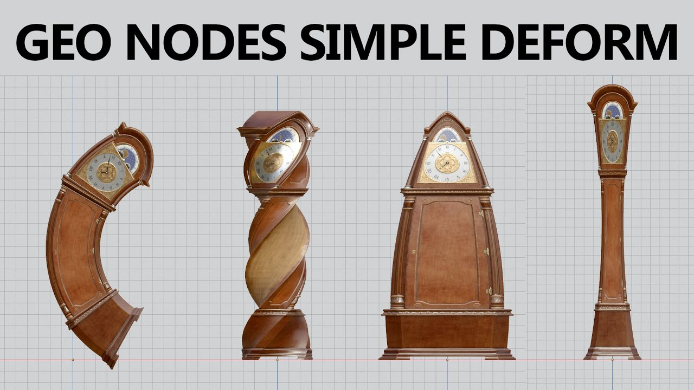
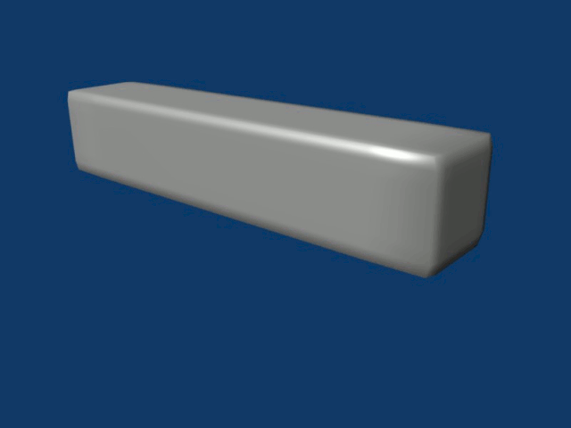
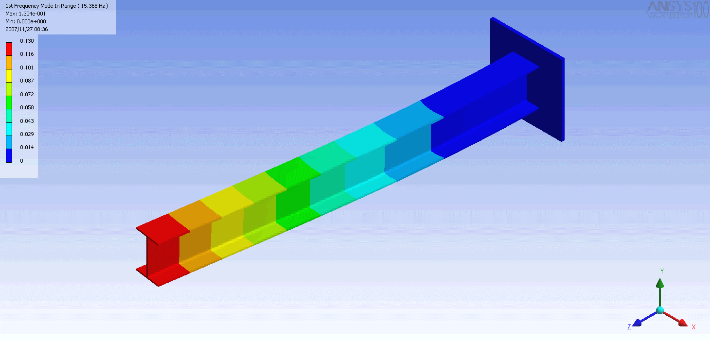

# Laboratório 08 - Aprofundando o uso de Transformações Geométricas com o *Three.JS* 

## Objetivos:

1. Consolidar o conceito de transformações geométricas e sua representação matemática;
2. Explorar o uso de transformações geométricas e sua implentação em GPU, através de *shaders*;
3. Construir e aplicar transformações mais complexas, envolvendo deformação dos objetos, e sua implementação através de *shaders*. 
 
## Exercícios:

1. Analise o exemplo "*01-Espelhamento*" que implementa a transformação de espelhamento [1] utilizando *shaders*. Entenda seu funcionamento e tire suas dúvidas com o professor e/ou monitor. Modifique esse exemplo para que o quadrado apareça como uma figura preenchida [2] [3]. O que acontece com a figura quando aplicados os espelhamentos? Por que? Pesquise como "ajustar" o exemplo. 

2. O exemplo "*02-Cisalhamento*" apresenta um quadrado ao qual deve ser aplicada uma transformação de **cisalhamento (*shear*)** [4] com os fatores na direção X e Y controlados pela GUI. Implemente tal transformação utilizando *shaders* para isso. 

3. O exemplo "*03-Deformacoes*" constroi um cenário com 3 blocos, e associa a cada bloco um *shaderMaterial* para que transformações de deformação possam ser aplicadas. Modifique esse exemplo e construa cada um dos *shaders* que implmentam as transformações de deformação de ***Tapering***, ***Twisting*** e ***Bending*** [5], como ilustrado na Figura 1. 

*Figura 1 - Transformações de Deformação. Da esquerda para a direita: ***Bending***, ***Twisting*** e ***Tapering***.* 

4. Modifique o exercício 3 para que as deformações possam ser visualizadas em uma animação, modificando a "intesidade" de seu efeito ao longo do tempo, como nos exemplos da Figura 2.

 

*Figura 2 - Animando transformações de deformação: ***Bending*** e ***Twisting***.*

5. No exemplo "*04-Instancias*" é apresentado uma forma mais eficiente de lidar com muitos objetos geométricos que possuem a mesma forma e diferem por sua posição, escala e orientação: o mecanismo de instâncias [6]. São definidas 3 esferas com cores diferentes e pretendem representar um sistema planetário com uma estrela, um planeta e um satélite, cada objeto com seus movimento orbital ao redor do outro. Acrescente a esse cenário o movimento de cada elemento orbitando os demais. 

## Referências: 

[1] 	MARSCHNER, Steve; SHIRLEY, Peter. "**Fundamentals of Computer Graphics**". 5th Edition CRC Press, 2021.

[2]		Dirksen, J., **Learn Three.JS: Program 3D animations and visualizations for the web with JavaScript and WebGL**. 4th Edition, Packt Publishing, 2023.

[3]		**Three.JS**. https://threejs.org/docs/index.html.

[4]     Wikipedia. **Transformação de cisalhamento**. https://pt.wikipedia.org/wiki/Transforma%C3%A7%C3%A3o_de_cisalhamento

[5]     Parent, Rick. **Computer animation: algorithms and techniques**. Newnes, 2012.

[6]     Three.JS Documentation. **InstancedMesh**. https://threejs.org/docs/#api/en/objects/InstancedMesh.
